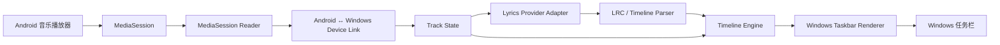

# LyricRelay MVP 架构

## 目标

在不改变用户 Android 播放习惯的前提下，把“当前播放歌曲 + 播放进度”可靠地同步到 Windows，并在任务栏渲染当前时间轴歌词。

## 总体数据流



## 模块职责

### Android Companion

- `MediaSessionReader`：读取活跃 MediaSession，标准化 Metadata 和 PlaybackState。
- `DeviceLink`：负责 QR 配对、局域网发现、长连接、心跳和重连。
- `StatePublisher`：去重并发送状态变化与周期性校准点。
- `Lifecycle`：处理系统授权、后台运行和播放器切换。

Android 只发送最小必要信息，不传输音频和歌词正文。

### Windows Client

- `DeviceLink`：发现已配对 Android 设备并接收协议消息。
- `LyricsCatalog`：根据歌曲信息查询 Provider，管理取消、超时和结果去重。
- `LyricsParser`：解析 LRC 时间标签，生成有序时间轴。
- `TimelineEngine`：基于最近一次手机状态和本地单调时钟推导当前行。
- `TaskbarRenderer`：将当前行绘制到任务栏可用区域，隔离 Win32/DPI 细节。
- `Settings`：仅保存 MVP 设置，不引入账号或云同步。

## 关键时序

1. Windows Client 启动并发布本机服务信息，显示一次性 QR 配对信息。
2. Android 扫码并确认配对；双方保存设备标识和设备密钥。
3. 后续双方通过局域网服务发现自动建立连接。
4. Android 发现 `trackId` 变化时立即发送完整 `track.state`。
5. Windows 取消旧歌词请求，按 `title + artist + album + duration` 查询同步歌词。
6. 歌词解析完成后，Timeline Engine 从最新播放状态建立基准。
7. 播放中由 Windows 本地时钟驱动刷新；Android 只按周期发送校准点。
8. 暂停、恢复、Seek 或切歌时，Windows 立即重置基准或替换时间轴。

## 时间轴算法

收到一条 `playing` 状态时记录：

```text
basePosition = positionMs
baseClock = monotonicNow()
speed = playbackSpeed
```

本地计算当前位置：

```text
currentPosition = basePosition + (monotonicNow() - baseClock) × speed
```

`paused` 和 `stopped` 状态固定在最近一次有效 `positionMs`。所有结果都限制在 `[0, durationMs]`（duration 已知时）。任何新状态、Seek 或重连后的完整状态都重新建立基准。墙上时间 `sentAt` 不参与播放位置计算，避免设备时钟差异导致漂移。

## 连接与恢复

- 配对：Windows 生成包含临时地址、端口、协议版本、设备 ID、一次性 token 和证书指纹的短期 QR 信息，Android 扫描后完成一次性确认。
- 发现：同一局域网内使用服务发现；发现结果必须匹配已绑定的设备 ID。
- 重连：指数退避，设置上限；连接恢复后 Android 主动发送完整状态。
- 断网：歌词时间轴可以短时继续按本地时钟运行；超过容忍窗口后显示连接状态而不是伪造实时准确性。
- 歌词请求：每个 `trackId` 只有一个生效请求；新歌到来时取消旧请求，旧结果不得覆盖新歌。

## Windows 任务栏渲染边界

任务栏集成是最容易受 Windows Shell 版本影响的部分，必须保持为独立适配器：

1. 定位 `Shell_TrayWnd`，创建无焦点、不可点击的任务栏子窗口。
2. 只通过 Win32 子窗口枚举读取任务栏占用区域，避免在 Explorer UI 树上做完整 UI Automation 扫描。
3. 按当前 DPI 计算文本区域，避免覆盖托盘和已有任务栏内容。
4. 使用当前进程内的轻量 Win32 子窗口和 GDI 文本绘制单行/双行歌词，不引入 WebView2/Chromium，也不把 WPF 窗口跨进程挂入 Explorer。
5. 只有歌词文本、显示设置或布局发生变化时才重绘；任务栏布局默认最多每秒刷新一次。
6. 亮色、暗色和任务栏尺寸变化时重新计算颜色与布局；窗口句柄失效或 Explorer 重启期间安全隐藏并重建原生子窗口。

如果 Shell 结构不可识别，Renderer 应降级为“不显示歌词但不影响连接和歌词获取”，并记录可诊断日志。

LyricRelay 的任务栏适配层直接采用 [ANYNC/TaskbarLyrics](https://github.com/ANYNC/TaskbarLyrics) 所采用的“Shell_TrayWnd 子窗口 + 可用间隙计算 + 原生轻量渲染”方案；仅保留自己的实现和依赖边界，不复制其代码，也不把它作为运行时依赖。

## 依赖方向

```text
Protocol → Link → Application State
Lyrics Parser → Timeline Engine → Renderer Adapter
```

- Timeline Engine 不依赖 Windows UI 或网络。
- Lyrics Parser 不依赖 Provider；Provider 只返回原始歌词或标准化时间轴。
- Android MediaSession 读取器不依赖 Windows 连接实现。
- 平台 API 只能出现在对应平台适配层，不向共享核心泄漏。

## 明确不做

本架构不包含音频传输、ASR、播客字幕、账号、云同步、桌面悬浮歌词、iOS、macOS 和多手机连接。
